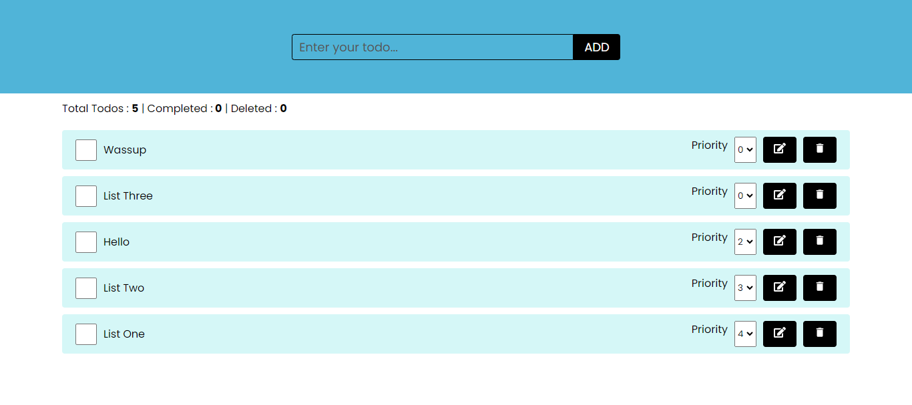

# Simple To-Do List

A basic to-do list application built with React. This project is designed to help you understand the fundamentals of React components, state management, and event handling.

## Table of Contents

1. [Introduction](#introduction)
2. [Features](#features)
3. [Demo](#demo)
4. [Getting Started](#getting-started)
5. [Installation](#installation)
6. [Usage](#usage)
7. [Folder Structure](#folder-structure)
8. [Contributing](#contributing)
9. [License](#license)
10. [Contact](#contact)

## Introduction

The Simple To-Do List app allows users to add, remove, and mark tasks as completed.

## Features

- Add new tasks.
- Mark tasks as completed.
- Remove tasks from the list.

<!-- ## Demo

Check out the live demo of the application [here](link-to-live-demo). -->

## Getting Started

To get a local copy up and running, follow these simple steps.

### Prerequisites

Ensure you have the following installed:

- Node.js (version 20.12.2 or higher)
- npm (version 10.5.0 or higher)



### Installation

1. Clone the repository:
   ```bash
   git clone https://github.com/ShashikantBharti/my_react_projects/tree/main/To-Do-List
   ```
2. Navigate to the project directory:
   ```bash
   cd to-do-list
   ```
3. Install the dependencies:
   ```bash
   npm i
   ```

## Usage

To run the app locally, use the following command:

```bash
npm run dev
```

## Folder Structure

```bash
simple-to-do-list/
├── public/
│ ├── index.html
│ └── ...
├── src/
│ ├── components/
│ │ ├── AddTodo.jsx
│ │ └── TodoItem.jsx
│ ├── App.css
│ ├── App.jsx
│ ├── index.css
│ └── index.jsx
├── .gitignore
├── package.json
└── README.md
```

## Components

- App.jsx: Main component that holds the state and renders the TodoForm and TodoList components.
- AddTodo.jsx: Contains the form for adding new tasks.
- TodoItem.jsx: Represents a single to-do item with options to mark as completed or delete.
